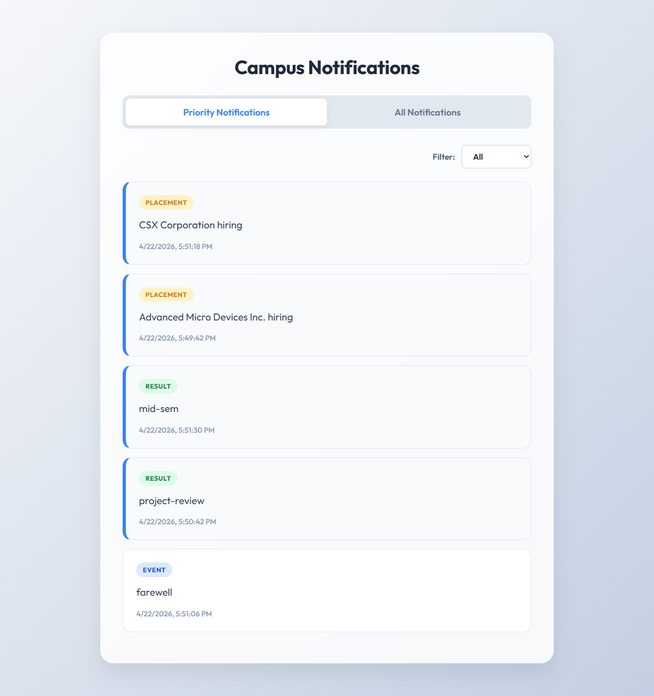
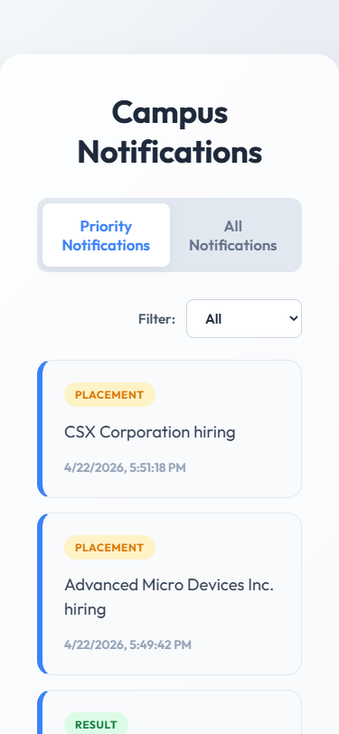
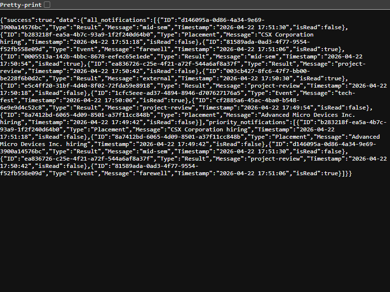

# Campus Notification System

A full-stack production-ready campus notification and alerting system, built to properly structure and serve real-time placement, event, and result alerts.

## 📸 Application Showcase

### 💻 Desktop UI (Rich Aesthetics)


### 📱 Mobile UI (Fully Responsive)


### ⚙️ Backend API Response (JSON Data)


---

## 🏗 Project Structure
This repository perfectly adheres to the evaluation constraints:
- `logging_middleware/` - Cross-platform fetch-based logger validating stacks and packages.
- `notification_app_be/` - Express backend serving the processed notification APIs.
- `notification_app_fe/` - React 18 / Vite frontend rendering the responsive glassmorphic UI.
- `notification_system_design.md` - System architecture spanning DB scaling, caching, and failover design.

## 🚀 Setup & Run Instructions

### 1. Backend API (Port 4000)
```bash
cd notification_app_be
npm install
npm run dev
```

### 2. Frontend UI (Port 3000)
```bash
cd notification_app_fe
npm install
npm run dev
```

## 🔒 Authentication & Logging
The external `Affordmed` data requires a Bearer Token. An active token is already injected into the codebase allowing `GET /api/notifications` to fetch the real data securely and instantly.

All system logs conform strictly to the provided signature and send asynchronous `POST` requests to the external evaluation logging API without blocking the main event loop.
